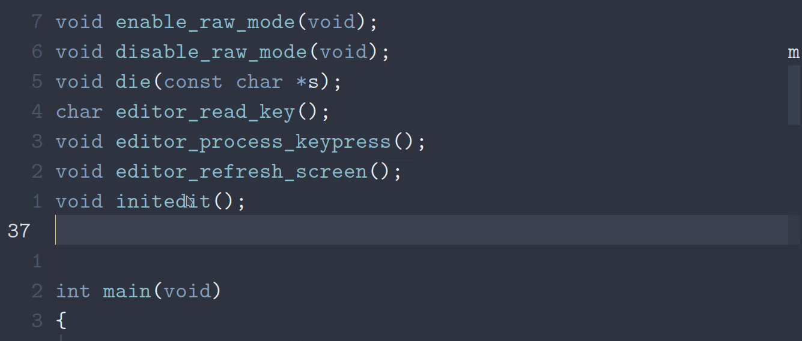

nvim-cmp Buffer Lines
================

## Contents

-   <a href="#preview" id="toc-preview">Preview</a>
-   <a href="#introduction" id="toc-introduction">Introduction</a>
-   <a href="#installation" id="toc-installation">Installation</a>
    -   <a href="#packernvim" id="toc-packernvim"><span>packer.nvim</span></a>
-   <a href="#setup" id="toc-setup">Setup</a>
    -   <a href="#only-for-certain-file-types"
        id="toc-only-for-certain-file-types">Only for certain file types</a>
-   <a href="#todo" id="toc-todo">TODO</a>

## Preview



## Introduction

nvim-cmp Buffer Lines is a completion source for
[nvim-cmp](https://github.com/hrsh7th/nvim-cmp) that provides a source
for all the lines in the current buffer. This is especially useful for
[C programmers](#only-for-certain-file-types).

## Installation

### [packer.nvim](https://github.com/wbthomason/packer.nvim)

``` lua
require "packer".startup(function(use)
    use "amarakon/nvim-cmp-buffer-lines"
end)
```

## Setup

``` lua
require "cmp".setup {
    sources = {
        { name = "buffer-lines" }
    }
}
```

### Only for certain file types

``` lua
-- Only enable `buffer-lines` for C and C++
require "cmp".setup.filetype({ "c", "cpp" }, {
    sources = {
        { name = "buffer-lines" }
    }
})
```

## TODO

-   [ ] Automatically update the source
-   [ ] Omit commented lines
-   [x] Omit duplicate lines
-   [ ] Add syntax highlighting
